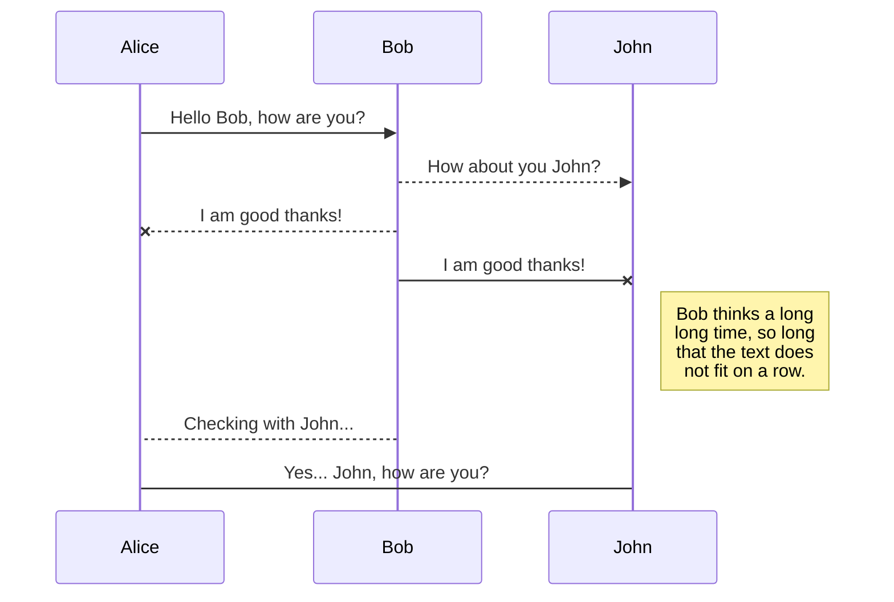
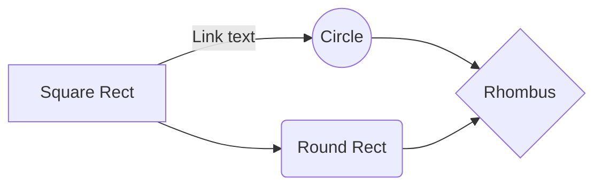

# Predicting spatiotemporal sequence of the astronomical cycle 

Link to article : *link will updated*

Authors: [Shashwat Singh](https://github.com/SSingh087/)† , [Atharva Modi](https://github.com/AntiNeutrino03), [Ankul Prajapati](https://www.researchgate.net/profile/Ankul_Prajapati), [K. N. Pathak](https://www.researchgate.net/profile/Kamlesh_Pathak)

† shashwat98singh@gmail.com 

The two models we present are ConvLSTM, Autoencoder-Decoder

Link to dataset:

## Experimentations

### ConvLSTM Model

 
Our primary experimentation result with the model layers and the filter size is shown in fig-
You can render UML diagrams using [Mermaid](https://mermaidjs.github.io/). For example, this will produce a sequence diagram:       

And this will produce a flow chart:

